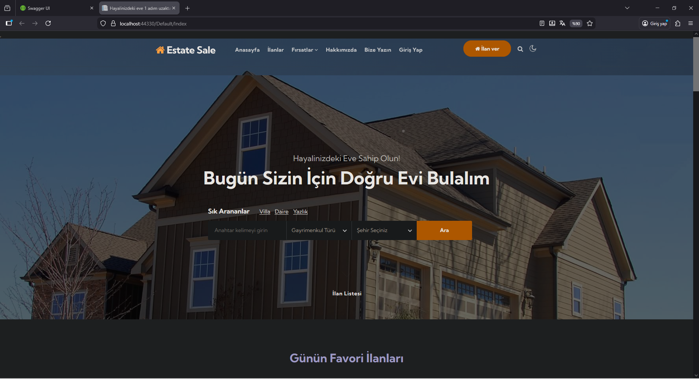
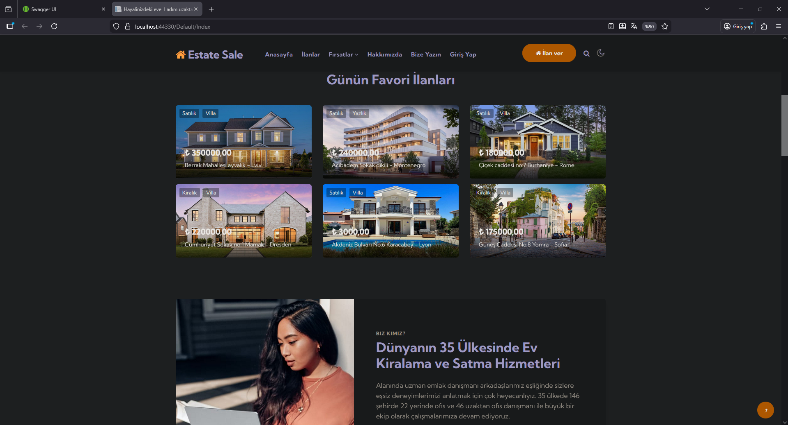

🏠 Real Estate Web Application

Real Estate, modern web teknolojileri kullanılarak geliştirilmiş,
API + MVC mimarisine sahip kapsamlı bir emlak satış & kiralama platformudur.

Bu proje; gerçek dünya senaryolarını baz alarak ölçeklenebilir, güvenli ve
katmanlı mimari prensipleriyle geliştirilmiştir.

🚀 Kullanılan Teknolojiler
Backend

ASP.NET Core Web API

ASP.NET Core MVC

Dapper ORM

AutoMapper

JWT (JSON Web Token) Authentication

SignalR (Real-time bildirimler)

RESTful API

SQL Server

Frontend

HTML5 / CSS3

Bootstrap

JavaScript

jQuery

AJAX

Razor View Engine

🧱 Mimari Yapı

Katmanlı Mimari (Layered Architecture)

API & UI ayrı projeler

DTO kullanımı

Repository Pattern

Asenkron programlama (async / await)

🔐 Güvenlik

JWT tabanlı kimlik doğrulama

Rol bazlı yetkilendirme

API endpoint güvenliği

⚡ Öne Çıkan Özellikler

🏘️ Satılık & kiralık emlak ilanları

🔍 Gelişmiş ilan arama ve filtreleme

👤 Kullanıcı & emlakçı yönetimi

📊 Admin paneli

🔔 SignalR ile gerçek zamanlı güncellemeler

📷 İlan görselleri yönetimi

🌙 Modern ve kullanıcı dostu arayüz

## 📸 Ekran Görüntüleri

### Ana Sayfa

### Günün Favori İlanları

### Son Eklenen İlanlar

### Tüm İlanlar

### İlan Detay Sayfası

